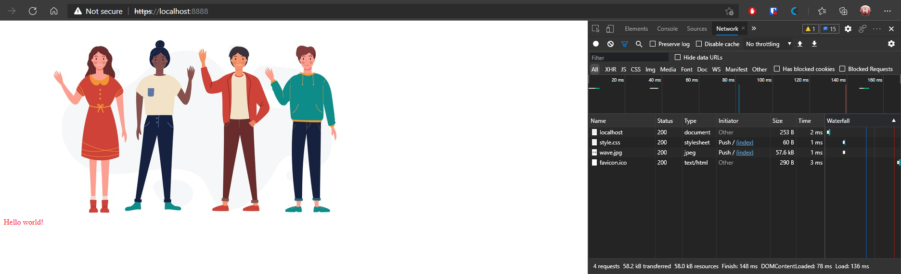

## Server start and listen

[source, shell]
----
tenhobi@tatooine:~/dev/NI-AM2/06/src$ npm start

> ni-am2-bittnja3-hw-6@1.0.0 start /home/tenhobi/dev/NI-AM2/06/src
> node server

responded with file  index.html
responded with file  /home/tenhobi/dev/NI-AM2/06/src/static/style.css
responded with file  /home/tenhobi/dev/NI-AM2/06/src/static/wave.jpg
----

## Browser

