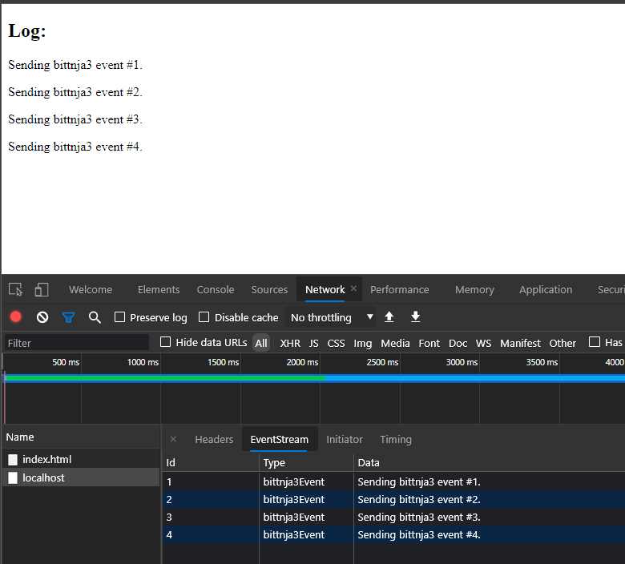

## Simple Server-sent events

### Server start

[source, shell]
----
tenhobi@tatooine:~/dev/NI-AM2/07/src$ npm start

> ni-am2-bittnja3-hw-7@1.0.0 start /home/tenhobi/dev/NI-AM2/07/src
> node server

1
2
3
4
----

### Client

