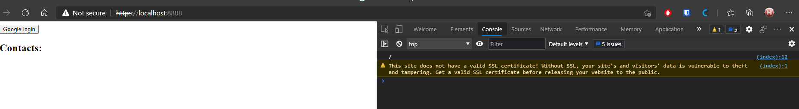
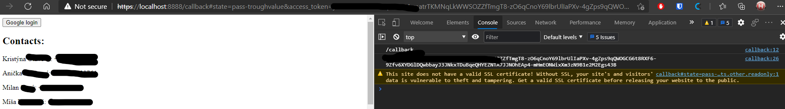

## OAuth - Browser-Based App

This task implements a simple HTTPS server,
that serves a simple Browser-Based App
that uses OAuth to access data.
I used Google OAuth2 with People API,
to access Google Contacts.

Used resources:

- App's client id+secret: https://console.cloud.google.com/apis/dashboard
- People API documentation: https://developers.google.com/people
- OAuth2 JS flow: https://developers.google.com/identity/protocols/oauth2/javascript-implicit-flow

### Initial page

On this page,
the user should click on the button
to start login process.
That redirects the user to Google login,
which is required for the OAuth2 to set up.

### Callback page

After the user gives access to the app,
they are redirected to our `/callback` page.
The JS app gets a OAuth2,
which is used to fetch all contacts from user's Google Contacts,
using People API,
and people's name and phone number are displayed.

