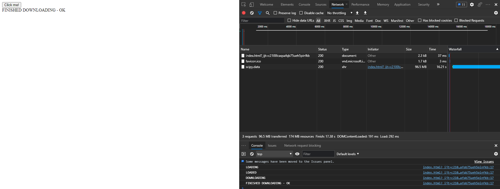
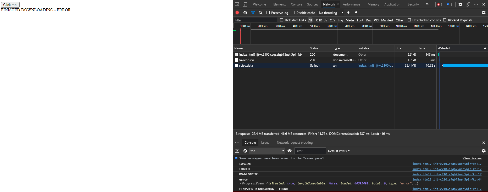

= HW2

Simple implementation of XHR downloading file.
The program outputs several logs on different stages of the process,
including recognizing successful and errored process.
First screen shows logs from success run.
Second screen shows logs from run with aborted connection,
leading to error.

