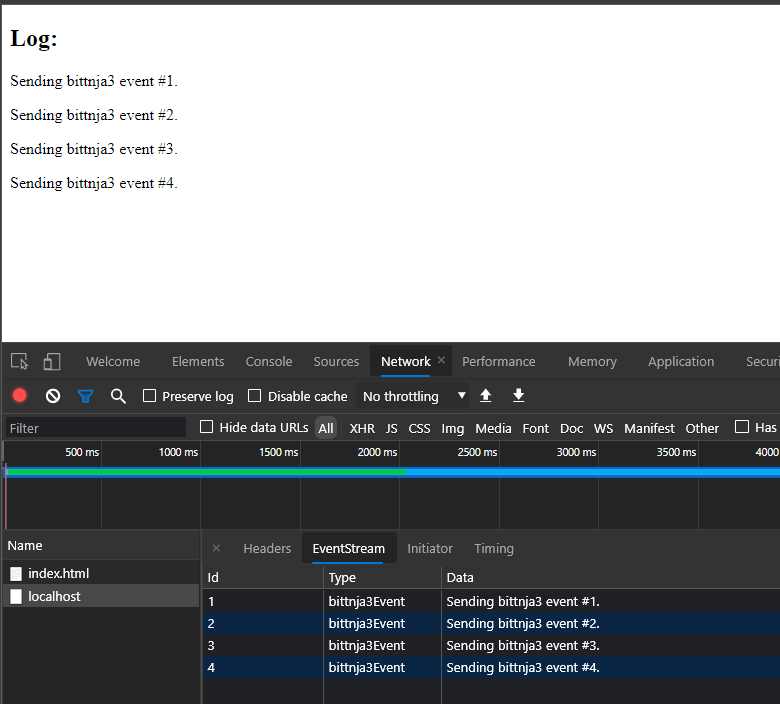

## Simple Server-sent events

This task implements simple Server-sent Events.

The client (browser) uses the `EventSource` API,
that subscribes to server that pushes `text/event-stream` messages.

### Server start

Every 2 seconds, the server pushes some message.

[source, shell]
----
tenhobi@tatooine:~/dev/NI-AM2/07/src$ npm start

> ni-am2-bittnja3-hw-7@1.0.0 start /home/tenhobi/dev/NI-AM2/07/src
> node server

1
2
3
4
----

### Client

Clients get the pushed event stream messages and can proccess them.

